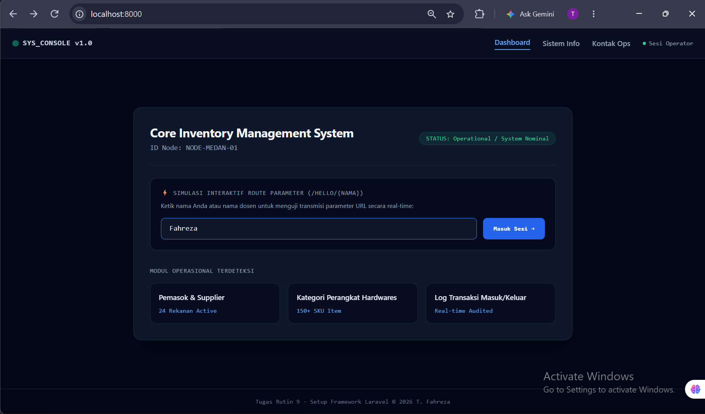
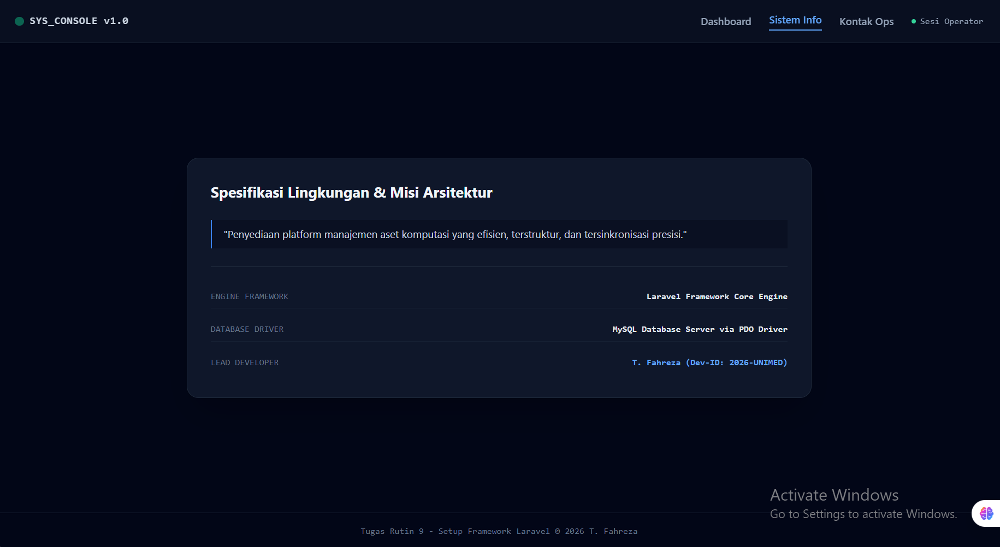
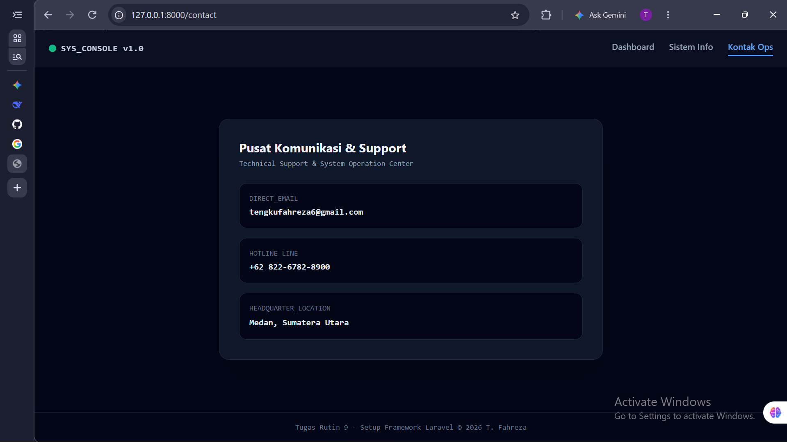
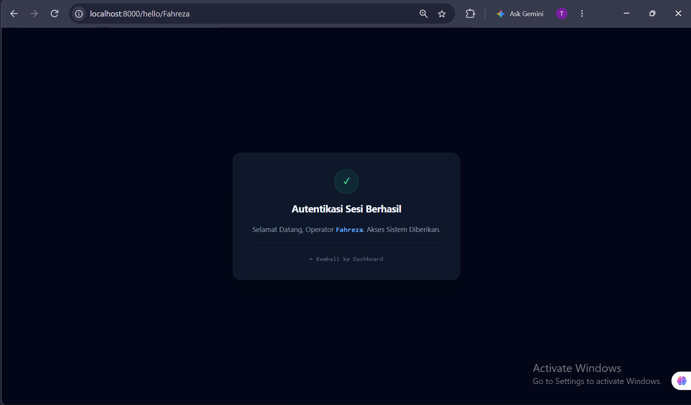

# 🚀 Tugas Rutin 9 — Setup & Fundamental Framework Laravel

[](https://laravel.com)
[](https://php.net)
[](https://tailwindcss.com)

Repositori ini memuat implementasi dasar, konfigurasi lingkungan lokal, arsitektur MVC, serta sistem routing dinamis pada **Framework Laravel** sebagai pemenuhan tugas mata kuliah Pemrograman Web (Tugas Rutin 9).

---

## 🔗 Tautan Repositori

- **GitHub Repository:** [TugasWeb-P9-LaravelSetup](https://github.com/tengkufahreza6-dev/TugasWeb-P9-LaravelSetup)

---

## 👤 Informasi Mahasiswa

| Keterangan | Detail |
| :--- | :--- |
| **Nama** | Tengku Fahreza |
| **NIM** | 4252550005 |
| **Kelas** | PSIK 25B |
| **Program Studi** | S1 Ilmu Komputer |
| **Mata Kuliah** | Pemrograman Web |
| **Instansi** | Universitas Negeri Medan (UNIMED) |
| **Repositori** | `TugasWeb-P9-LaravelSetup` |
| **Database Target** | `tugasweb_p9` |

---

## 📌 Ringkasan Proyek

Aplikasi ini dirancang menggunakan arsitektur **Model-View-Controller (MVC)** dengan antarmuka berbasis *Console/Dashboard Operations* yang memanfaatkan styling Tailwind CSS. Proyek ini membuktikan keberhasilan pengintegrasian infrastruktur backend lokal (PHP 8.3 & MySQL via Laragon) hingga perenderan komponen tampilan Blade secara dinamis.

---

## 📋 Checklist Persyaratan Tugas (Requirements)

| No | Kriteria Tugas | Status | Keterangan / Implementasi |
| :-: | :--- | :---: | :--- |
| 1 | **Instalasi Laravel** | ✅ Done | Diinstal via Composer `composer create-project` |
| 2 | **Konfigurasi Database** | ✅ Done | Terhubung ke MySQL `tugasweb_p9` melalui file `.env` |
| 3 | **Eksekusi Server** | ✅ Done | Berjalan stabil via `php artisan serve` |
| 4 | **Custom Routing** | ✅ Done | Memiliki route `/`, `/about`, `/contact`, dan `/hello/{nama}` |
| 5 | **Data Dinamis View** | ✅ Done | Menerima & merender data array dinamis dari Controller |
| 6 | **Generator MVC** | ✅ Done | Tergenerasi `MainController` dan Model `Barang` beserta migration |
| 7 | **Dokumentasi README** | ✅ Done | Penjelasan struktur folder & langkah eksekusi lengkap |
| 8 | **Repositori GitHub** | ✅ Done | Disinkronkan ke repo `TugasWeb-P9-LaravelSetup` |
| 9 | **Fitur Bonus** | ✅ Done | Styling UI Tailwind CSS CDN & Route Parameter Dinamis |

---

## 📷 Tangkapan Layar Antarmuka

### 1. Welcome Page & Dashboard

| Welcome Page Laravel | Halaman Dashboard (Route `/`) |
| :---: | :---: |
|  |  |
| Halaman default Laravel setelah instalasi | Dashboard utama dengan data array dinamis |

### 2. Halaman Route Custom

| Halaman About (Route `/about`) | Halaman Contact (Route `/contact`) |
| :---: | :---: |
|  |  |
| Informasi arsitektur sistem & developer | Pusat komunikasi & support operasional |

### 3. Fitur Bonus — Route Parameter Dinamis

| Halaman `/hello/{nama}` |
| :---: |
|  |
| Route parameter dinamis yang menampilkan nama operator dari URL |

---

## 📂 Struktur Direktori Proyek

Berikut adalah struktur folder utama yang digunakan dalam proyek ini beserta penjelasannya:

```text
TugasWeb-P9-LaravelSetup/
│
├── app/                                # Kode inti aplikasi (MVC)
│   ├── Http/
│   │   ├── Controllers/
│   │   │   └── MainController.php      # [MODIFIED] Logika bisnis & penyedia data array
│   │   └── Middleware/                 # Filter HTTP request (bawaan Laravel)
│   └── Models/
│       └── Barang.php                  # [MODIFIED] Model ORM Eloquent untuk tabel barang
│
├── bootstrap/                          # Bootstrap framework (cache & app startup)
│   └── cache/                          # Cache konfigurasi & routing
│
├── config/                             # Konfigurasi framework Laravel
│   ├── app.php                         # Konfigurasi aplikasi utama
│   ├── database.php                    # Konfigurasi koneksi database
│   └── ...                             # Konfigurasi lainnya (auth, cache, session, dll.)
│
├── database/                           # Semua yang berkaitan dengan database
│   ├── migrations/                     # [MODIFIED] Skema struktur tabel MySQL
│   ├── seeders/                        # Data awal/seed (opsional)
│   └── factories/                      # Factory untuk testing (opsional)
│
├── public/                             # Document root (akses publik)
│   └── index.php                       # Entry point aplikasi Laravel
│
├── resources/                          # Sumber daya tampilan (View)
│   └── views/                          # [MODIFIED] Blade Templating Engine
│       ├── welcome.blade.php           # Halaman default Laravel (screenshot wajib)
│       ├── home.blade.php              # [CUSTOM] Tampilan utama Dashboard (/)
│       ├── about.blade.php             # [CUSTOM] Tampilan Sistem Info (/about)
│       ├── contact.blade.php           # [CUSTOM] Tampilan Kontak Ops (/contact)
│       └── hello.blade.php             # [CUSTOM] Tampilan route parameter (/hello/{nama})
│
├── routes/                             # Deklarasi routing aplikasi
│   ├── web.php                         # [MODIFIED] Route URL (web)
│   ├── console.php                     # Route untuk Artisan command
│   └── channels.php                    # Route untuk broadcasting (opsional)
│
├── storage/                            # Penyimpanan runtime
│   ├── app/                            # File upload & generated files
│   ├── framework/                      # Cache, session, views compiled
│   └── logs/                           # Log aplikasi (laravel.log)
│
├── tests/                              # Unit & Feature testing (opsional)
│
├── vendor/                             # Dependencies dari Composer (JANGAN edit)
│
├── .env                                # [MODIFIED] Konfigurasi environment & database
├── .env.example                        # Template environment (untuk clone)
├── artisan                             # CLI Laravel (php artisan ...)
├── composer.json                       # Manifest dependencies PHP
└── README.md                           # [MODIFIED] Dokumentasi teknis proyek
```

### Keterangan Status:
- **[MODIFIED]** = File/folder yang dimodifikasi untuk keperluan tugas
- **[CUSTOM]** = File yang dibuat sendiri untuk tugas
- **Tanpa label** = Struktur bawaan framework Laravel

---

## ⚙️ Panduan Instalasi & Menjalankan Proyek

Ikuti langkah-langkah di bawah ini untuk mengkloning dan menjalankan proyek ini di lingkungan lokal Anda:

### 1. Kloning Repositori

```bash
git clone https://github.com/tengkufahreza6-dev/TugasWeb-P9-LaravelSetup.git
cd TugasWeb-P9-LaravelSetup
```

### 2. Pasang Dependencies Composer

```bash
composer install
```

### 3. Konfigurasi Environment File

Salin file konfigurasi contoh dan buat database baru di phpMyAdmin/MySQL dengan nama `tugasweb_p9`:

```bash
cp .env.example .env
```

Pastikan konfigurasi database di file `.env` telah disesuaikan:

```env
DB_CONNECTION=mysql
DB_HOST=127.0.0.1
DB_PORT=3306
DB_DATABASE=tugasweb_p9
DB_USERNAME=root
DB_PASSWORD=
```

### 4. Generate Application Key

```bash
php artisan key:generate
```

### 5. Jalankan Migrasi Database

```bash
php artisan migrate
```

### 6. Jalankan Server Lokal

```bash
php artisan serve
```

Akses aplikasi melalui peramban web pada tautan: **`http://127.0.0.1:8000`**

---

## 🛠️ Teknologi yang Digunakan

| Teknologi | Fungsi |
| :--- | :--- |
| **Laravel 11/12** | Framework PHP dengan arsitektur MVC |
| **PHP 8.3** | Bahasa pemrograman backend |
| **MySQL 8.0** | Database relasional |
| **Blade Templating** | Engine tampilan Laravel |
| **Tailwind CSS (CDN)** | Styling UI modern |
| **Composer** | Manajemen dependencies PHP |
| **Laragon** | Web server lokal development |

---

<p align="center">
  <strong>© 2026 Tengku Fahreza — PSIK 25B — UNIMED</strong><br>
  Dibuat untuk pemenuhan tugas akademik <strong>Tugas Rutin 9</strong> mata kuliah Pemrograman Web.
</p>